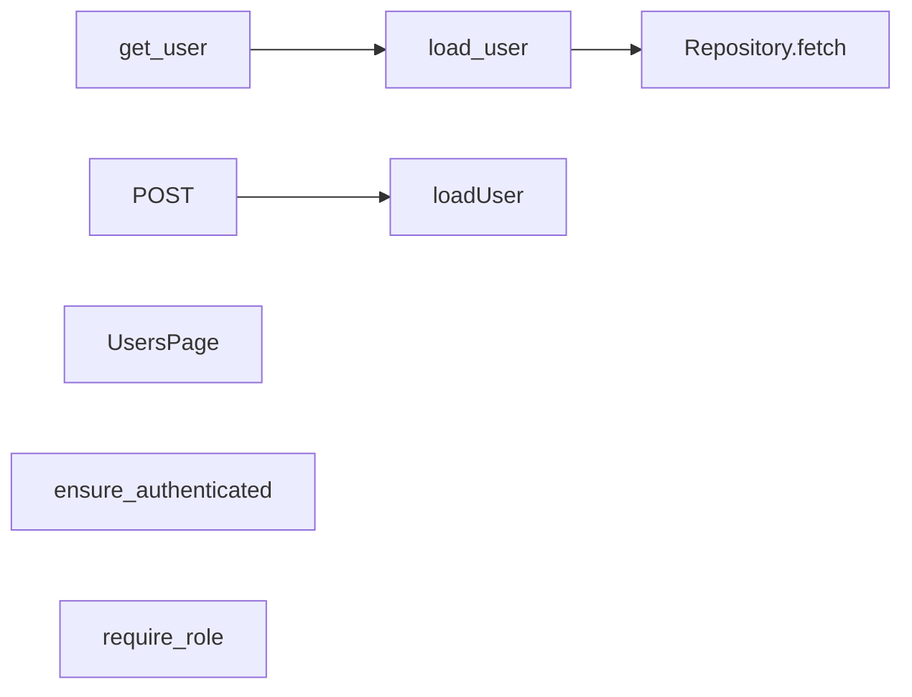
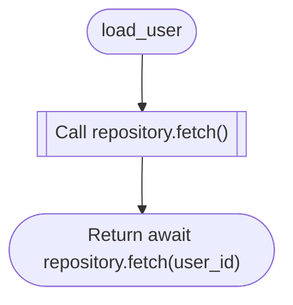
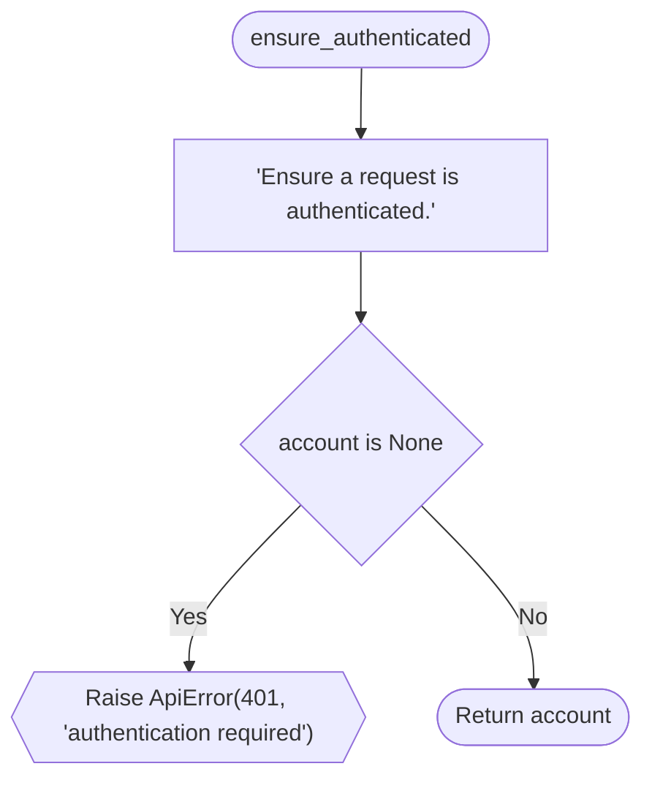
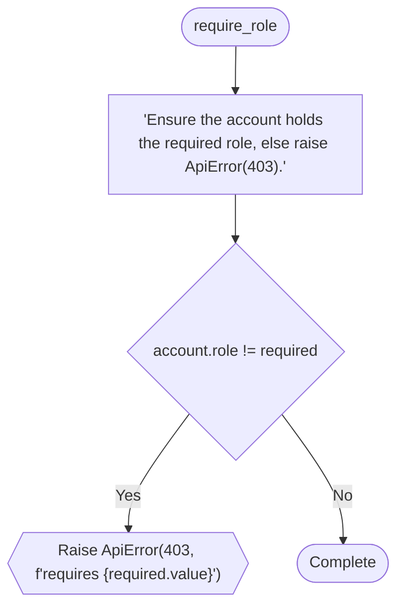
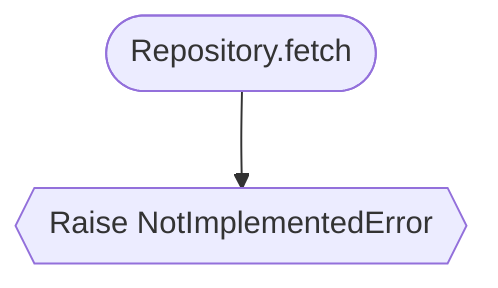
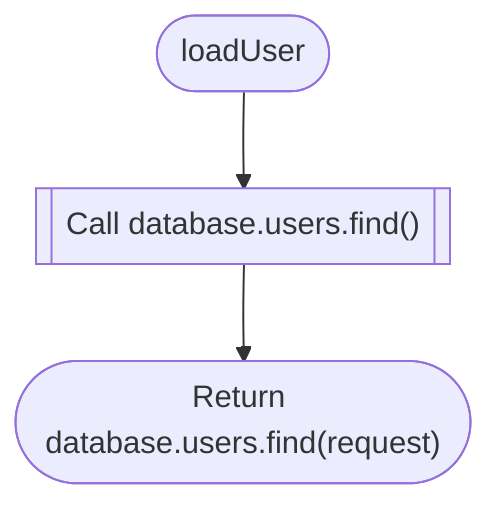

# LogicChart Decision Flows

> Generated from source code. Do not edit this file manually.

- **Generated:** `2026-06-15T16:25:15.828934+00:00`
- **Source root:** `.`
- **Flows:** 9
- **Entry points:** 6
- **Potential gaps:** 1

## Project Map

## Findings

- **WARNING · missing_branch** Decision has no explicit fallback: switch user.status ([`examples/demo/frontend/app/api/users/route.ts:4`](../examples/demo/frontend/app/api/users/route.ts#L4))

## Entry Point Flows

### get_user

`route` · `python` · `fastapi` · [`examples/demo/backend/users.py:23`](../examples/demo/backend/users.py#L23)

### load_user

`function` · `python` · `generic` · [`examples/demo/backend/users.py:32`](../examples/demo/backend/users.py#L32)

### POST

`route` · `typescript` · `nextjs` · [`examples/demo/frontend/app/api/users/route.ts:1`](../examples/demo/frontend/app/api/users/route.ts#L1)

**Review points:**
- `Switch on user.status`: Decision has no explicit fallback: switch user.status

### UsersPage

`component` · `typescript` · `nextjs` · [`examples/demo/frontend/app/users/page.tsx:1`](../examples/demo/frontend/app/users/page.tsx#L1)

### ensure_authenticated

`function` · `python` · `generic` · [`examples/shop/backend/auth.py:12`](../examples/shop/backend/auth.py#L12)

### require_role

`function` · `python` · `generic` · [`examples/shop/backend/auth.py:6`](../examples/shop/backend/auth.py#L6)

## Referenced Subflows

### Repository.fetch

`method` · `python` · `generic` · [`examples/demo/backend/users.py:9`](../examples/demo/backend/users.py#L9)

### loadUser

`function` · `typescript` · `generic` · [`examples/demo/frontend/app/api/users/route.ts:12`](../examples/demo/frontend/app/api/users/route.ts#L12)

