# LogicChart Decision Flows

> Generated from source code. Do not edit this file manually.

- **Generated:** `2026-06-15T14:00:09.606805+00:00`
- **Source root:** `.`
- **Flows:** 132
- **Entry points:** 30
- **Potential gaps:** 14

## Project Map

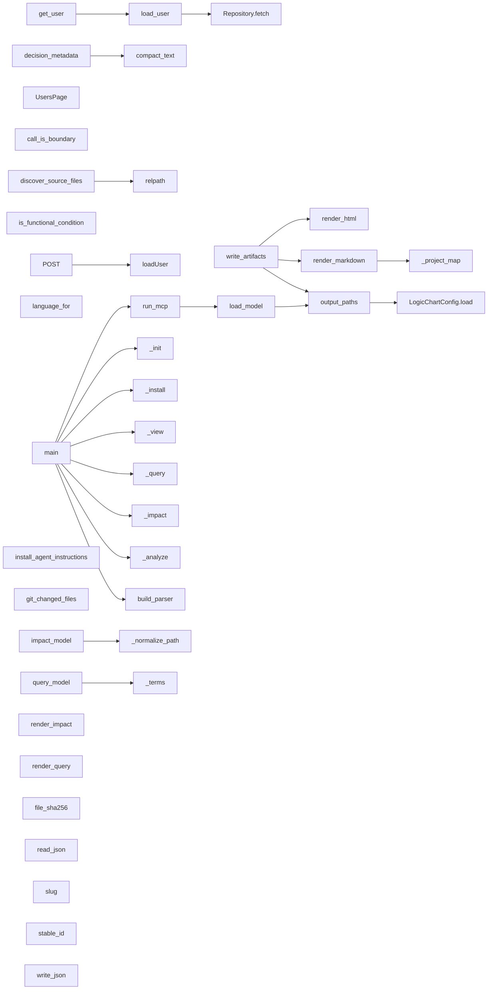

## Findings

- **WARNING · missing_branch** Decision has no explicit fallback: switch user.status ([`examples/demo/frontend/app/api/users/route.ts:4`](../examples/demo/frontend/app/api/users/route.ts#L4))
- **WARNING · inconsistent_case_handling** Related flows explicitly mention additional kind cases; review fallback handling for: NodeKind.CALL, NodeKind.DECISION ([`src/logicchart/render/markdown.py:117`](../src/logicchart/render/markdown.py#L117))
- **WARNING · inconsistent_case_handling** Related flows explicitly mention additional kind cases; review fallback handling for: NodeKind.CALL, NodeKind.ERROR ([`src/logicchart/render/markdown.py:113`](../src/logicchart/render/markdown.py#L113))
- **WARNING · inconsistent_case_handling** Related flows explicitly mention additional kind cases; review fallback handling for: NodeKind.DECISION, NodeKind.ERROR ([`src/logicchart/render/markdown.py:115`](../src/logicchart/render/markdown.py#L115))
- **WARNING · inconsistent_case_handling** Related flows explicitly mention additional status cases; review fallback handling for: UserStatus.ACTIVE ([`examples/demo/backend/users.py:27`](../examples/demo/backend/users.py#L27))
- **WARNING · inconsistent_case_handling** Related flows explicitly mention additional type cases; review fallback handling for: CALLABLE_VALUE_TYPES, FUNCTION_TYPES, catch_clause, class_declaration, else_clause, export_statement, finally_clause, method_definition, not ([`src/logicchart/analysis/typescript.py:419`](../src/logicchart/analysis/typescript.py#L419))
- **WARNING · inconsistent_case_handling** Related flows explicitly mention additional type cases; review fallback handling for: CALLABLE_VALUE_TYPES, FUNCTION_TYPES, catch_clause, class_declaration, else_clause, export_statement, finally_clause, not, variable_declarator ([`src/logicchart/analysis/typescript.py:412`](../src/logicchart/analysis/typescript.py#L412))
- **WARNING · inconsistent_case_handling** Related flows explicitly mention additional type cases; review fallback handling for: CALLABLE_VALUE_TYPES, FUNCTION_TYPES, catch_clause, class_declaration, else_clause, export_statement, method_definition, not, variable_declarator ([`src/logicchart/analysis/typescript.py:509`](../src/logicchart/analysis/typescript.py#L509))
- **WARNING · inconsistent_case_handling** Related flows explicitly mention additional type cases; review fallback handling for: CALLABLE_VALUE_TYPES, FUNCTION_TYPES, catch_clause, class_declaration, else_clause, finally_clause, method_definition, not, variable_declarator ([`src/logicchart/analysis/typescript.py:388`](../src/logicchart/analysis/typescript.py#L388))
- **WARNING · inconsistent_case_handling** Related flows explicitly mention additional type cases; review fallback handling for: CALLABLE_VALUE_TYPES, FUNCTION_TYPES, catch_clause, class_declaration, export_statement, finally_clause, method_definition, not, variable_declarator ([`src/logicchart/analysis/typescript.py:503`](../src/logicchart/analysis/typescript.py#L503))
- **WARNING · inconsistent_case_handling** Related flows explicitly mention additional type cases; review fallback handling for: CALLABLE_VALUE_TYPES, FUNCTION_TYPES, catch_clause, else_clause, export_statement, finally_clause, method_definition, not, variable_declarator ([`src/logicchart/analysis/typescript.py:392`](../src/logicchart/analysis/typescript.py#L392))
- **WARNING · inconsistent_case_handling** Related flows explicitly mention additional type cases; review fallback handling for: CALLABLE_VALUE_TYPES, FUNCTION_TYPES, class_declaration, else_clause, export_statement, finally_clause, method_definition, not, variable_declarator ([`src/logicchart/analysis/typescript.py:506`](../src/logicchart/analysis/typescript.py#L506))
- **WARNING · inconsistent_case_handling** Related flows explicitly mention additional type cases; review fallback handling for: CALLABLE_VALUE_TYPES, catch_clause, class_declaration, else_clause, export_statement, finally_clause, method_definition, not, variable_declarator ([`src/logicchart/analysis/typescript.py:402`](../src/logicchart/analysis/typescript.py#L402))
- **WARNING · inconsistent_case_handling** Related flows explicitly mention additional type cases; review fallback handling for: FUNCTION_TYPES, catch_clause, class_declaration, else_clause, export_statement, finally_clause, method_definition, variable_declarator ([`src/logicchart/analysis/typescript.py:422`](../src/logicchart/analysis/typescript.py#L422))

## Entry Point Flows

### get_user

`route` · `python` · `fastapi` · [`examples/demo/backend/users.py:23`](../examples/demo/backend/users.py#L23)

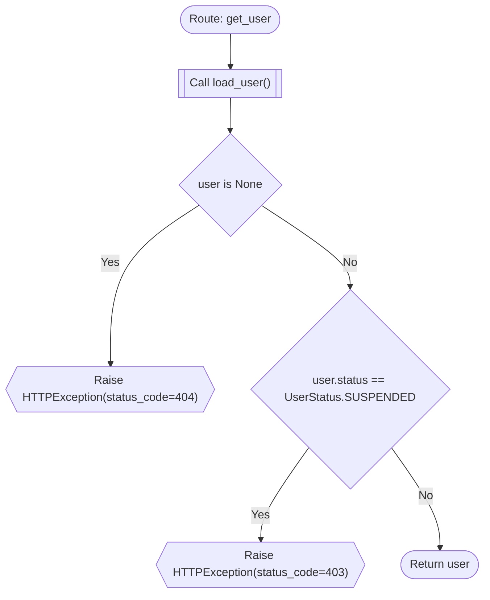

**Review points:**
- `user.status == UserStatus.SUSPENDED`: Related flows explicitly mention additional status cases; review fallback handling for: UserStatus.ACTIVE

### load_user

`function` · `python` · `generic` · [`examples/demo/backend/users.py:32`](../examples/demo/backend/users.py#L32)


### POST

`route` · `typescript` · `nextjs` · [`examples/demo/frontend/app/api/users/route.ts:1`](../examples/demo/frontend/app/api/users/route.ts#L1)

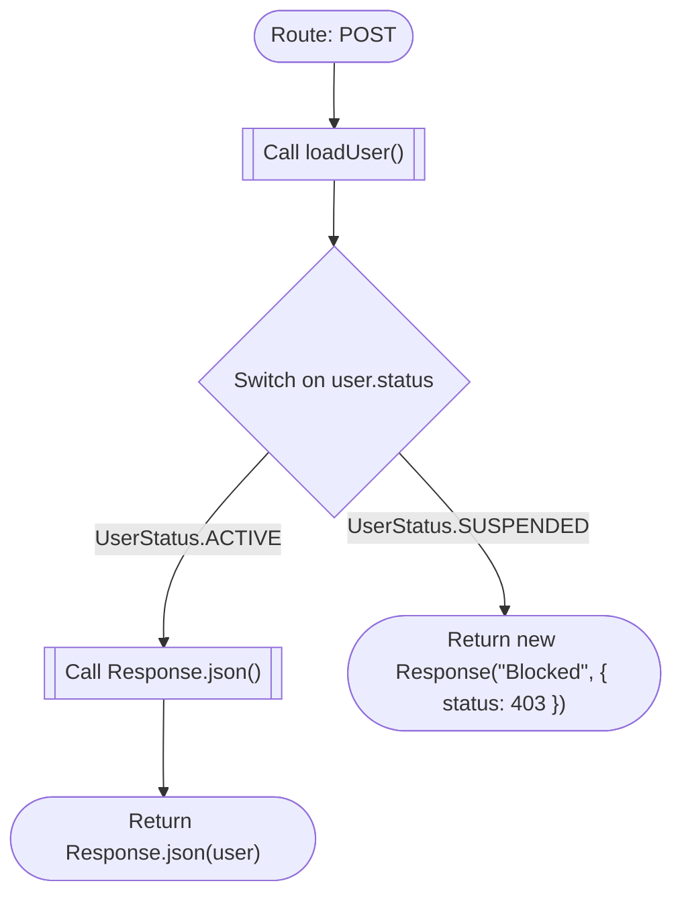

**Review points:**
- `Switch on user.status`: Decision has no explicit fallback: switch user.status

### UsersPage

`component` · `typescript` · `nextjs` · [`examples/demo/frontend/app/users/page.tsx:1`](../examples/demo/frontend/app/users/page.tsx#L1)

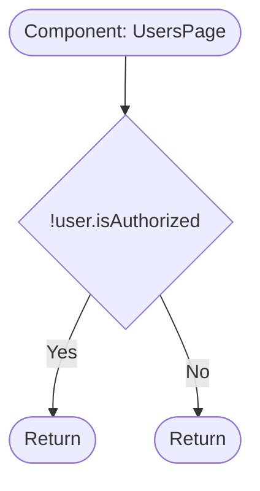

### call_is_boundary

`function` · `python` · `generic` · [`src/logicchart/analysis/common.py:183`](../src/logicchart/analysis/common.py#L183)

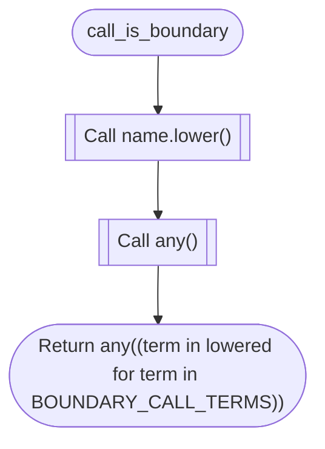

### decision_metadata

`function` · `python` · `generic` · [`src/logicchart/analysis/common.py:161`](../src/logicchart/analysis/common.py#L161)

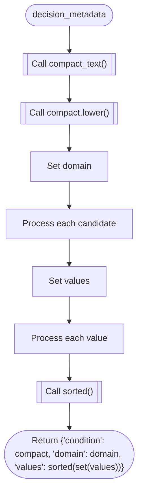

### is_functional_condition

`function` · `python` · `generic` · [`src/logicchart/analysis/common.py:151`](../src/logicchart/analysis/common.py#L151)

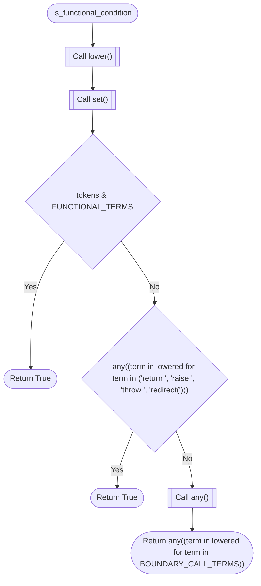

### discover_source_files

`function` · `python` · `generic` · [`src/logicchart/analysis/discovery.py:11`](../src/logicchart/analysis/discovery.py#L11)

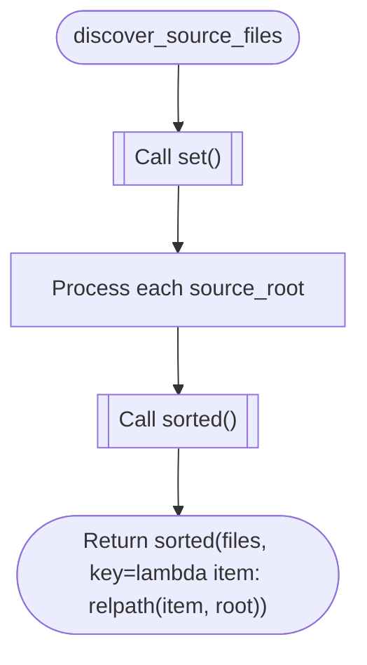

### language_for

`function` · `python` · `generic` · [`src/logicchart/analysis/discovery.py:27`](../src/logicchart/analysis/discovery.py#L27)

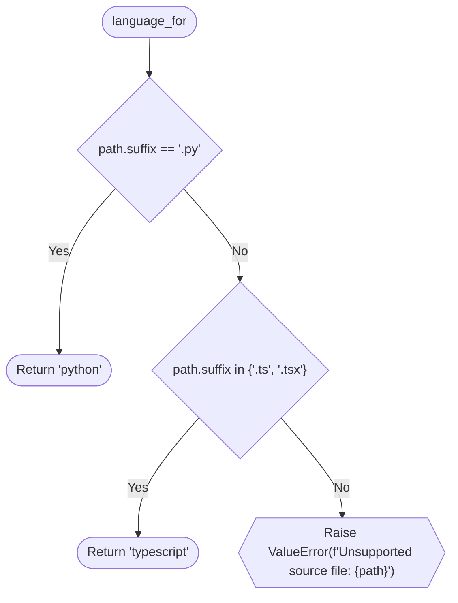

### load_model

`function` · `python` · `generic` · [`src/logicchart/artifacts.py:43`](../src/logicchart/artifacts.py#L43)

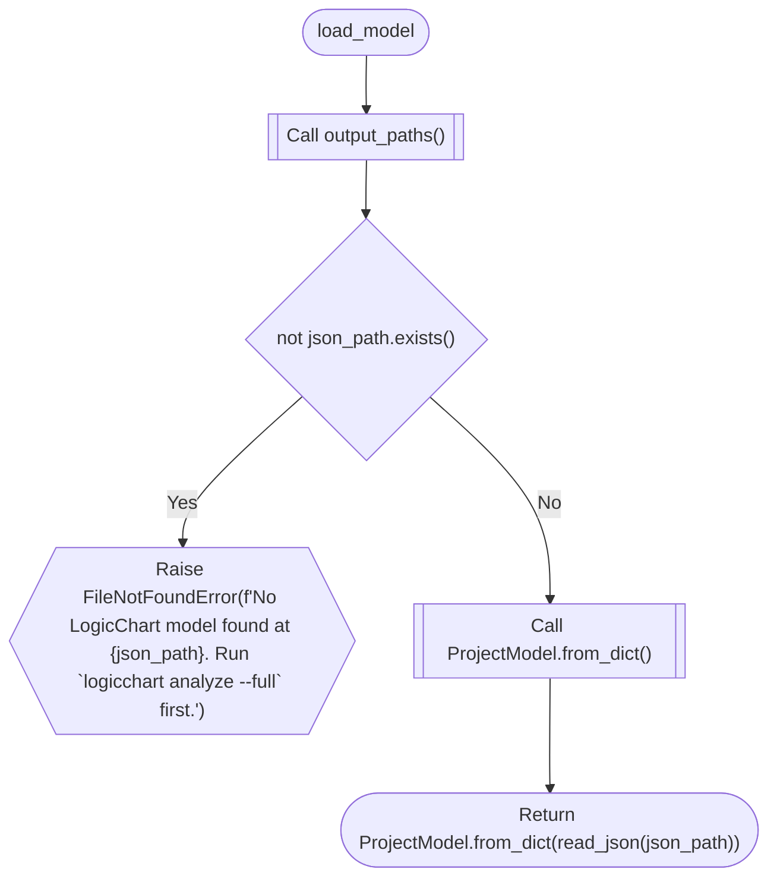

### output_paths

`function` · `python` · `generic` · [`src/logicchart/artifacts.py:12`](../src/logicchart/artifacts.py#L12)

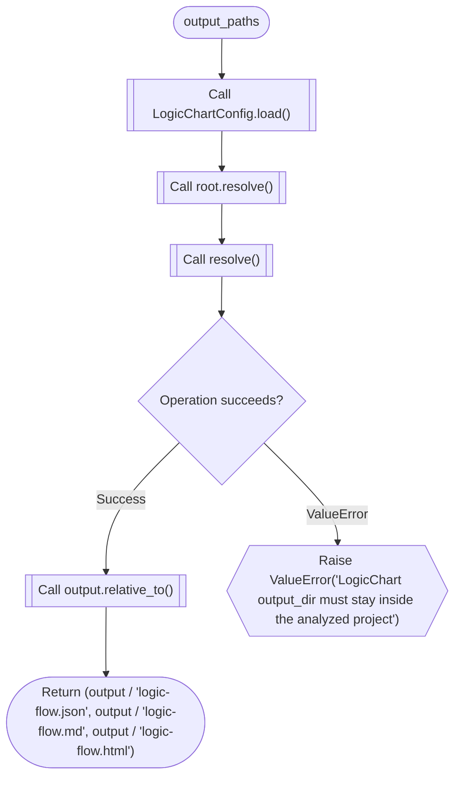

### write_artifacts

`function` · `python` · `generic` · [`src/logicchart/artifacts.py:27`](../src/logicchart/artifacts.py#L27)

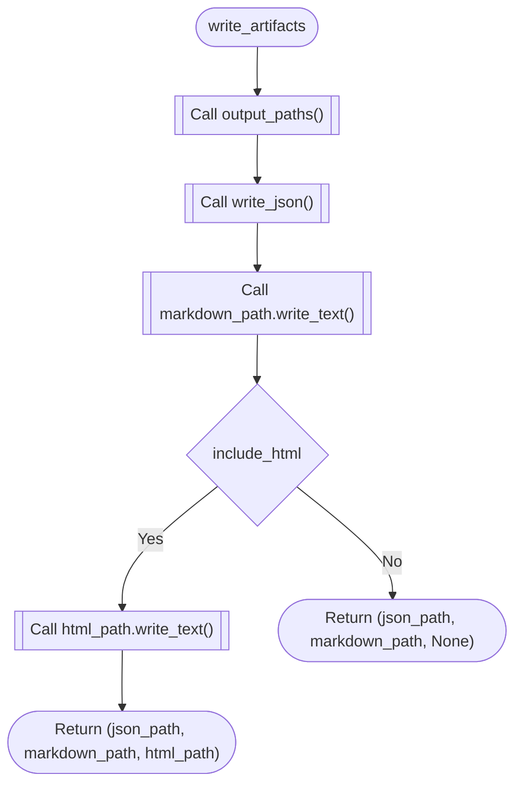

### build_parser

`function` · `python` · `generic` · [`src/logicchart/cli.py:27`](../src/logicchart/cli.py#L27)

```mermaid
flowchart TD
  mflow_a6de5af1a50108ec_n1(["build_parser"])
  mflow_a6de5af1a50108ec_n2[["Call argparse.ArgumentParser()"]]
  mflow_a6de5af1a50108ec_n3[["Call parser.add_argument()"]]
  mflow_a6de5af1a50108ec_n4[["Call parser.add_subparsers()"]]
  mflow_a6de5af1a50108ec_n5[["Call subparsers.add_parser()"]]
  mflow_a6de5af1a50108ec_n6[["Call analyze.add_argument()"]]
  mflow_a6de5af1a50108ec_n7[["Call analyze.add_argument()"]]
  mflow_a6de5af1a50108ec_n8[["Call analyze.add_argument()"]]
  mflow_a6de5af1a50108ec_n9[["Call subparsers.add_parser()"]]
  mflow_a6de5af1a50108ec_n10[["Call update.add_argument()"]]
  mflow_a6de5af1a50108ec_n11[["Call update.add_argument()"]]
  mflow_a6de5af1a50108ec_n12[["Call subparsers.add_parser()"]]
  mflow_a6de5af1a50108ec_n13[["Call impact.add_argument()"]]
  mflow_a6de5af1a50108ec_n14[["Call impact.add_argument()"]]
  mflow_a6de5af1a50108ec_n15[["Call impact.add_argument()"]]
  mflow_a6de5af1a50108ec_n16[["Call subparsers.add_parser()"]]
  mflow_a6de5af1a50108ec_n17[["Call query.add_argument()"]]
  mflow_a6de5af1a50108ec_n18[["Call query.add_argument()"]]
  mflow_a6de5af1a50108ec_n19[["Call query.add_argument()"]]
  mflow_a6de5af1a50108ec_n20[["Call query.add_argument()"]]
  mflow_a6de5af1a50108ec_n21[["Call subparsers.add_parser()"]]
  mflow_a6de5af1a50108ec_n22[["Call view.add_argument()"]]
  mflow_a6de5af1a50108ec_n23[["Call view.add_argument()"]]
  mflow_a6de5af1a50108ec_n24[["Call view.add_argument()"]]
  mflow_a6de5af1a50108ec_n25[["Call view.add_argument()"]]
  mflow_a6de5af1a50108ec_n26[["Call subparsers.add_parser()"]]
  mflow_a6de5af1a50108ec_n27[["Call install.add_argument()"]]
  mflow_a6de5af1a50108ec_n28[["Call install.add_argument()"]]
  mflow_a6de5af1a50108ec_n29[["Call subparsers.add_parser()"]]
  mflow_a6de5af1a50108ec_n30[["Call init.add_argument()"]]
  mflow_a6de5af1a50108ec_n31[["Call subparsers.add_parser()"]]
  mflow_a6de5af1a50108ec_n32[["Call mcp.add_argument()"]]
  mflow_a6de5af1a50108ec_n33(["Return parser"])
  mflow_a6de5af1a50108ec_n1 --> mflow_a6de5af1a50108ec_n2
  mflow_a6de5af1a50108ec_n2 --> mflow_a6de5af1a50108ec_n3
  mflow_a6de5af1a50108ec_n3 --> mflow_a6de5af1a50108ec_n4
  mflow_a6de5af1a50108ec_n4 --> mflow_a6de5af1a50108ec_n5
  mflow_a6de5af1a50108ec_n5 --> mflow_a6de5af1a50108ec_n6
  mflow_a6de5af1a50108ec_n6 --> mflow_a6de5af1a50108ec_n7
  mflow_a6de5af1a50108ec_n7 --> mflow_a6de5af1a50108ec_n8
  mflow_a6de5af1a50108ec_n8 --> mflow_a6de5af1a50108ec_n9
  mflow_a6de5af1a50108ec_n9 --> mflow_a6de5af1a50108ec_n10
  mflow_a6de5af1a50108ec_n10 --> mflow_a6de5af1a50108ec_n11
  mflow_a6de5af1a50108ec_n11 --> mflow_a6de5af1a50108ec_n12
  mflow_a6de5af1a50108ec_n12 --> mflow_a6de5af1a50108ec_n13
  mflow_a6de5af1a50108ec_n13 --> mflow_a6de5af1a50108ec_n14
  mflow_a6de5af1a50108ec_n14 --> mflow_a6de5af1a50108ec_n15
  mflow_a6de5af1a50108ec_n15 --> mflow_a6de5af1a50108ec_n16
  mflow_a6de5af1a50108ec_n16 --> mflow_a6de5af1a50108ec_n17
  mflow_a6de5af1a50108ec_n17 --> mflow_a6de5af1a50108ec_n18
  mflow_a6de5af1a50108ec_n18 --> mflow_a6de5af1a50108ec_n19
  mflow_a6de5af1a50108ec_n19 --> mflow_a6de5af1a50108ec_n20
  mflow_a6de5af1a50108ec_n20 --> mflow_a6de5af1a50108ec_n21
  mflow_a6de5af1a50108ec_n21 --> mflow_a6de5af1a50108ec_n22
  mflow_a6de5af1a50108ec_n22 --> mflow_a6de5af1a50108ec_n23
  mflow_a6de5af1a50108ec_n23 --> mflow_a6de5af1a50108ec_n24
  mflow_a6de5af1a50108ec_n24 --> mflow_a6de5af1a50108ec_n25
  mflow_a6de5af1a50108ec_n25 --> mflow_a6de5af1a50108ec_n26
  mflow_a6de5af1a50108ec_n26 --> mflow_a6de5af1a50108ec_n27
  mflow_a6de5af1a50108ec_n27 --> mflow_a6de5af1a50108ec_n28
  mflow_a6de5af1a50108ec_n28 --> mflow_a6de5af1a50108ec_n29
  mflow_a6de5af1a50108ec_n29 --> mflow_a6de5af1a50108ec_n30
  mflow_a6de5af1a50108ec_n30 --> mflow_a6de5af1a50108ec_n31
  mflow_a6de5af1a50108ec_n31 --> mflow_a6de5af1a50108ec_n32
  mflow_a6de5af1a50108ec_n32 --> mflow_a6de5af1a50108ec_n33
```

### main

`function` · `python` · `generic` · [`src/logicchart/cli.py:79`](../src/logicchart/cli.py#L79)

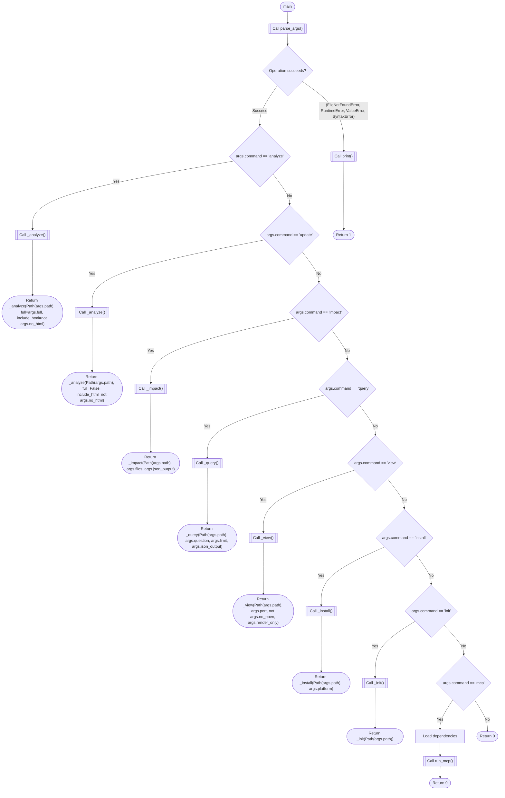

### install_agent_instructions

`function` · `python` · `generic` · [`src/logicchart/install.py:34`](../src/logicchart/install.py#L34)

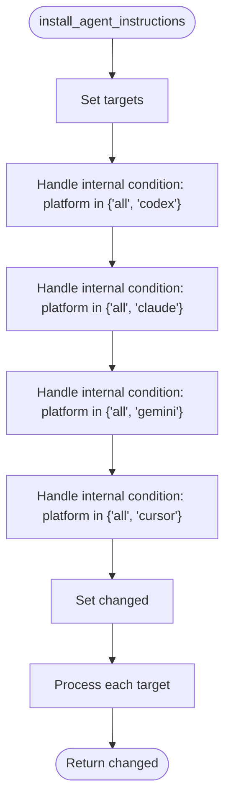

### run_mcp

`function` · `python` · `generic` · [`src/logicchart/mcp_server.py:11`](../src/logicchart/mcp_server.py#L11)

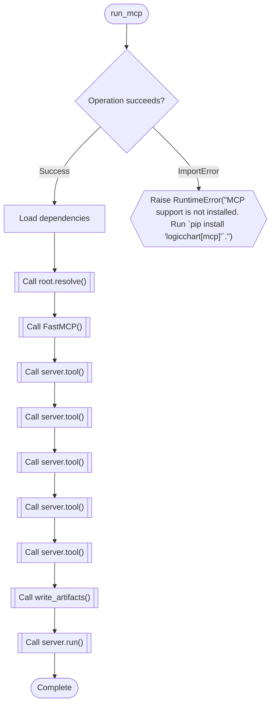

### git_changed_files

`function` · `python` · `generic` · [`src/logicchart/query.py:137`](../src/logicchart/query.py#L137)

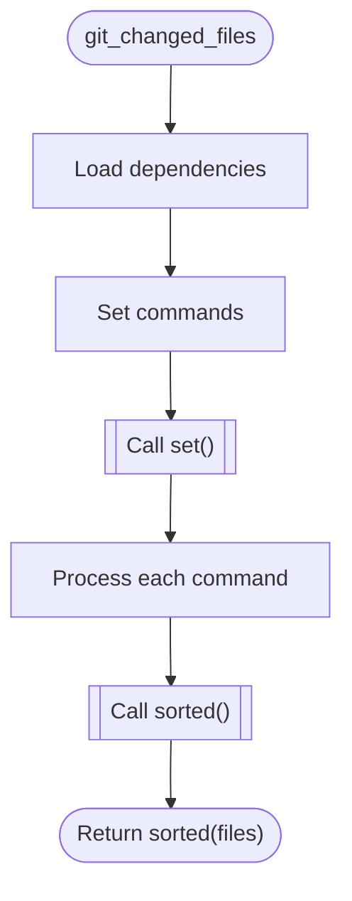

### impact_model

`function` · `python` · `generic` · [`src/logicchart/query.py:64`](../src/logicchart/query.py#L64)

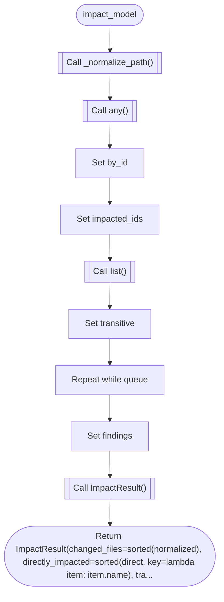

### query_model

`function` · `python` · `generic` · [`src/logicchart/query.py:32`](../src/logicchart/query.py#L32)

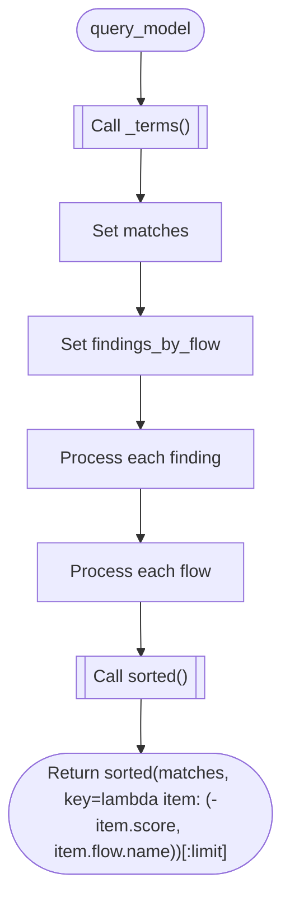

### render_impact

`function` · `python` · `generic` · [`src/logicchart/query.py:112`](../src/logicchart/query.py#L112)

```mermaid
flowchart TD
  mflow_3882f3a8065e5b53_n1(["render_impact"])
  mflow_3882f3a8065e5b53_n2[["Call len()"]]
  mflow_3882f3a8065e5b53_n3["Handle internal condition: result.directly_impacted"]
  mflow_3882f3a8065e5b53_n4["Handle internal condition: result.transitively_impacted"]
  mflow_3882f3a8065e5b53_n5["Handle internal condition: result.findings"]
  mflow_3882f3a8065e5b53_n6[["Call join()"]]
  mflow_3882f3a8065e5b53_n7(["Return '\\n'.join(lines)"])
  mflow_3882f3a8065e5b53_n1 --> mflow_3882f3a8065e5b53_n2
  mflow_3882f3a8065e5b53_n2 --> mflow_3882f3a8065e5b53_n3
  mflow_3882f3a8065e5b53_n3 --> mflow_3882f3a8065e5b53_n4
  mflow_3882f3a8065e5b53_n4 --> mflow_3882f3a8065e5b53_n5
  mflow_3882f3a8065e5b53_n5 --> mflow_3882f3a8065e5b53_n6
  mflow_3882f3a8065e5b53_n6 --> mflow_3882f3a8065e5b53_n7
```

### render_query

`function` · `python` · `generic` · [`src/logicchart/query.py:98`](../src/logicchart/query.py#L98)

```mermaid
flowchart TD
  mflow_8ab21f1b01feedc9_n1(["render_query"])
  mflow_8ab21f1b01feedc9_n2{"not matches"}
  mflow_8ab21f1b01feedc9_n3(["Return 'No matching logic flows found.'"])
  mflow_8ab21f1b01feedc9_n4["Set lines"]
  mflow_8ab21f1b01feedc9_n5["Process each (index, match)"]
  mflow_8ab21f1b01feedc9_n6[["Call join()"]]
  mflow_8ab21f1b01feedc9_n7(["Return '\\n'.join(lines)"])
  mflow_8ab21f1b01feedc9_n1 --> mflow_8ab21f1b01feedc9_n2
  mflow_8ab21f1b01feedc9_n2 -->|"Yes"| mflow_8ab21f1b01feedc9_n3
  mflow_8ab21f1b01feedc9_n2 -->|"No"| mflow_8ab21f1b01feedc9_n4
  mflow_8ab21f1b01feedc9_n4 --> mflow_8ab21f1b01feedc9_n5
  mflow_8ab21f1b01feedc9_n5 --> mflow_8ab21f1b01feedc9_n6
  mflow_8ab21f1b01feedc9_n6 --> mflow_8ab21f1b01feedc9_n7
```

### render_html

`function` · `python` · `generic` · [`src/logicchart/render/html.py:9`](../src/logicchart/render/html.py#L9)

```mermaid
flowchart TD
  mflow_7af1e93fe37c70d3_n1(["render_html"])
  mflow_7af1e93fe37c70d3_n2[["Call model.to_dict()"]]
  mflow_7af1e93fe37c70d3_n3{"source_root is not None"}
  mflow_7af1e93fe37c70d3_n4[["Call str()"]]
  mflow_7af1e93fe37c70d3_n5[["Call replace()"]]
  mflow_7af1e93fe37c70d3_n6[["Call _HTML_TEMPLATE.replace()"]]
  mflow_7af1e93fe37c70d3_n7(["Return _HTML_TEMPLATE.replace('__LOGICCHART_DATA__', payload)"])
  mflow_7af1e93fe37c70d3_n1 --> mflow_7af1e93fe37c70d3_n2
  mflow_7af1e93fe37c70d3_n2 --> mflow_7af1e93fe37c70d3_n3
  mflow_7af1e93fe37c70d3_n3 -->|"Yes"| mflow_7af1e93fe37c70d3_n4
  mflow_7af1e93fe37c70d3_n4 --> mflow_7af1e93fe37c70d3_n5
  mflow_7af1e93fe37c70d3_n3 -->|"No"| mflow_7af1e93fe37c70d3_n5
  mflow_7af1e93fe37c70d3_n5 --> mflow_7af1e93fe37c70d3_n6
  mflow_7af1e93fe37c70d3_n6 --> mflow_7af1e93fe37c70d3_n7
```

### render_markdown

`function` · `python` · `generic` · [`src/logicchart/render/markdown.py:8`](../src/logicchart/render/markdown.py#L8)

```mermaid
flowchart TD
  mflow_7a38a2ad775ce8ec_n1(["render_markdown"])
  mflow_7a38a2ad775ce8ec_n2["Set entrypoints"]
  mflow_7a38a2ad775ce8ec_n3[["Call len()"]]
  mflow_7a38a2ad775ce8ec_n4[["Call lines.extend()"]]
  mflow_7a38a2ad775ce8ec_n5[["Call lines.extend()"]]
  mflow_7a38a2ad775ce8ec_n6["Handle internal condition: model.findings"]
  mflow_7a38a2ad775ce8ec_n7[["Call lines.extend()"]]
  mflow_7a38a2ad775ce8ec_n8["Process each flow"]
  mflow_7a38a2ad775ce8ec_n9[["Call flow.metadata.get()"]]
  mflow_7a38a2ad775ce8ec_n10["Handle internal condition: subflows"]
  mflow_7a38a2ad775ce8ec_n11[["Call rstrip()"]]
  mflow_7a38a2ad775ce8ec_n12(["Return '\\n'.join(lines).rstrip() + '\\n'"])
  mflow_7a38a2ad775ce8ec_n1 --> mflow_7a38a2ad775ce8ec_n2
  mflow_7a38a2ad775ce8ec_n2 --> mflow_7a38a2ad775ce8ec_n3
  mflow_7a38a2ad775ce8ec_n3 --> mflow_7a38a2ad775ce8ec_n4
  mflow_7a38a2ad775ce8ec_n4 --> mflow_7a38a2ad775ce8ec_n5
  mflow_7a38a2ad775ce8ec_n5 --> mflow_7a38a2ad775ce8ec_n6
  mflow_7a38a2ad775ce8ec_n6 --> mflow_7a38a2ad775ce8ec_n7
  mflow_7a38a2ad775ce8ec_n7 --> mflow_7a38a2ad775ce8ec_n8
  mflow_7a38a2ad775ce8ec_n8 --> mflow_7a38a2ad775ce8ec_n9
  mflow_7a38a2ad775ce8ec_n9 --> mflow_7a38a2ad775ce8ec_n10
  mflow_7a38a2ad775ce8ec_n10 --> mflow_7a38a2ad775ce8ec_n11
  mflow_7a38a2ad775ce8ec_n11 --> mflow_7a38a2ad775ce8ec_n12
```

### compact_text

`function` · `python` · `generic` · [`src/logicchart/util.py:35`](../src/logicchart/util.py#L35)

```mermaid
flowchart TD
  mflow_ec8fb019cd5be666_n1(["compact_text"])
  mflow_ec8fb019cd5be666_n2[["Call strip()"]]
  mflow_ec8fb019cd5be666_n3{"len(value) <= limit"}
  mflow_ec8fb019cd5be666_n4(["Return value"])
  mflow_ec8fb019cd5be666_n5[["Call rstrip()"]]
  mflow_ec8fb019cd5be666_n6(["Return value[:limit - 1].rstrip() + '...'"])
  mflow_ec8fb019cd5be666_n1 --> mflow_ec8fb019cd5be666_n2
  mflow_ec8fb019cd5be666_n2 --> mflow_ec8fb019cd5be666_n3
  mflow_ec8fb019cd5be666_n3 -->|"Yes"| mflow_ec8fb019cd5be666_n4
  mflow_ec8fb019cd5be666_n3 -->|"No"| mflow_ec8fb019cd5be666_n5
  mflow_ec8fb019cd5be666_n5 --> mflow_ec8fb019cd5be666_n6
```

### file_sha256

`function` · `python` · `generic` · [`src/logicchart/util.py:15`](../src/logicchart/util.py#L15)

```mermaid
flowchart TD
  mflow_715ee001c87b2b23_n1(["file_sha256"])
  mflow_715ee001c87b2b23_n2[["Call hashlib.sha256()"]]
  mflow_715ee001c87b2b23_n3[["Call digest.update()"]]
  mflow_715ee001c87b2b23_n4[["Call digest.hexdigest()"]]
  mflow_715ee001c87b2b23_n5(["Return digest.hexdigest()"])
  mflow_715ee001c87b2b23_n1 --> mflow_715ee001c87b2b23_n2
  mflow_715ee001c87b2b23_n2 --> mflow_715ee001c87b2b23_n3
  mflow_715ee001c87b2b23_n3 --> mflow_715ee001c87b2b23_n4
  mflow_715ee001c87b2b23_n4 --> mflow_715ee001c87b2b23_n5
```

### read_json

`function` · `python` · `generic` · [`src/logicchart/util.py:23`](../src/logicchart/util.py#L23)

```mermaid
flowchart TD
  mflow_70222b30ba404ea2_n1(["read_json"])
  mflow_70222b30ba404ea2_n2[["Call cast()"]]
  mflow_70222b30ba404ea2_n3(["Return cast(dict[str, Any], json.loads(path.read_text(encoding='utf-8')))"])
  mflow_70222b30ba404ea2_n1 --> mflow_70222b30ba404ea2_n2
  mflow_70222b30ba404ea2_n2 --> mflow_70222b30ba404ea2_n3
```

### relpath

`function` · `python` · `generic` · [`src/logicchart/util.py:47`](../src/logicchart/util.py#L47)

```mermaid
flowchart TD
  mflow_e624ee18c6d55b5f_n1(["relpath"])
  mflow_e624ee18c6d55b5f_n2[["Call as_posix()"]]
  mflow_e624ee18c6d55b5f_n3(["Return path.resolve().relative_to(root.resolve()).as_posix()"])
  mflow_e624ee18c6d55b5f_n1 --> mflow_e624ee18c6d55b5f_n2
  mflow_e624ee18c6d55b5f_n2 --> mflow_e624ee18c6d55b5f_n3
```

### slug

`function` · `python` · `generic` · [`src/logicchart/util.py:42`](../src/logicchart/util.py#L42)

```mermaid
flowchart TD
  mflow_e7f4c7b212088b21_n1(["slug"])
  mflow_e7f4c7b212088b21_n2[["Call lower()"]]
  mflow_e7f4c7b212088b21_n3(["Return normalized or 'flow'"])
  mflow_e7f4c7b212088b21_n1 --> mflow_e7f4c7b212088b21_n2
  mflow_e7f4c7b212088b21_n2 --> mflow_e7f4c7b212088b21_n3
```

### stable_id

`function` · `python` · `generic` · [`src/logicchart/util.py:10`](../src/logicchart/util.py#L10)

```mermaid
flowchart TD
  mflow_9815dcf343f99f02_n1(["stable_id"])
  mflow_9815dcf343f99f02_n2[["Call encode()"]]
  mflow_9815dcf343f99f02_n3[["Call hexdigest()"]]
  mflow_9815dcf343f99f02_n4(["Return hashlib.sha256(payload).hexdigest()[:length]"])
  mflow_9815dcf343f99f02_n1 --> mflow_9815dcf343f99f02_n2
  mflow_9815dcf343f99f02_n2 --> mflow_9815dcf343f99f02_n3
  mflow_9815dcf343f99f02_n3 --> mflow_9815dcf343f99f02_n4
```

### write_json

`function` · `python` · `generic` · [`src/logicchart/util.py:27`](../src/logicchart/util.py#L27)

```mermaid
flowchart TD
  mflow_3a2ba54649479d1d_n1(["write_json"])
  mflow_3a2ba54649479d1d_n2[["Call path.parent.mkdir()"]]
  mflow_3a2ba54649479d1d_n3[["Call path.write_text()"]]
  mflow_3a2ba54649479d1d_n4(["Complete"])
  mflow_3a2ba54649479d1d_n1 --> mflow_3a2ba54649479d1d_n2
  mflow_3a2ba54649479d1d_n2 --> mflow_3a2ba54649479d1d_n3
  mflow_3a2ba54649479d1d_n3 --> mflow_3a2ba54649479d1d_n4
```


## Referenced Subflows

### Repository.fetch

`method` · `python` · `generic` · [`examples/demo/backend/users.py:9`](../examples/demo/backend/users.py#L9)

```mermaid
flowchart TD
  mflow_6306314dcc318fc3_n1(["Repository.fetch"])
  mflow_6306314dcc318fc3_n2{{"Raise NotImplementedError"}}
  mflow_6306314dcc318fc3_n1 --> mflow_6306314dcc318fc3_n2
```

### loadUser

`function` · `typescript` · `generic` · [`examples/demo/frontend/app/api/users/route.ts:12`](../examples/demo/frontend/app/api/users/route.ts#L12)

```mermaid
flowchart TD
  mflow_5c518b0f2169bf38_n1(["loadUser"])
  mflow_5c518b0f2169bf38_n2[["Call database.users.find()"]]
  mflow_5c518b0f2169bf38_n3(["Return database.users.find(request)"])
  mflow_5c518b0f2169bf38_n1 --> mflow_5c518b0f2169bf38_n2
  mflow_5c518b0f2169bf38_n2 --> mflow_5c518b0f2169bf38_n3
```

### FlowBuilder.add_node

`method` · `python` · `generic` · [`src/logicchart/analysis/common.py:83`](../src/logicchart/analysis/common.py#L83)

```mermaid
flowchart TD
  mflow_0ca098ef93b91c85_n1(["FlowBuilder.add_node"])
  mflow_0ca098ef93b91c85_n2["Set self._node_number"]
  mflow_0ca098ef93b91c85_n3[["Call FlowNode()"]]
  mflow_0ca098ef93b91c85_n4[["Call self.flow.nodes.append()"]]
  mflow_0ca098ef93b91c85_n5["Process each endpoint"]
  mflow_0ca098ef93b91c85_n6(["Return node"])
  mflow_0ca098ef93b91c85_n1 --> mflow_0ca098ef93b91c85_n2
  mflow_0ca098ef93b91c85_n2 --> mflow_0ca098ef93b91c85_n3
  mflow_0ca098ef93b91c85_n3 --> mflow_0ca098ef93b91c85_n4
  mflow_0ca098ef93b91c85_n4 --> mflow_0ca098ef93b91c85_n5
  mflow_0ca098ef93b91c85_n5 --> mflow_0ca098ef93b91c85_n6
```

### ProjectAnalyzer._combine

`method` · `python` · `generic` · [`src/logicchart/analysis/project.py:109`](../src/logicchart/analysis/project.py#L109)

```mermaid
flowchart TD
  mflow_aa8e4e724f6a6caf_n1(["ProjectAnalyzer._combine"])
  mflow_aa8e4e724f6a6caf_n2["Set flows"]
  mflow_aa8e4e724f6a6caf_n3["Set findings"]
  mflow_aa8e4e724f6a6caf_n4[["Call self._link_calls()"]]
  mflow_aa8e4e724f6a6caf_n5[["Call self._link_tests()"]]
  mflow_aa8e4e724f6a6caf_n6[["Call findings.extend()"]]
  mflow_aa8e4e724f6a6caf_n7[["Call _deduplicate_findings()"]]
  mflow_aa8e4e724f6a6caf_n8[["Call FileRecord()"]]
  mflow_aa8e4e724f6a6caf_n9[["Call ProjectModel()"]]
  mflow_aa8e4e724f6a6caf_n10(["Return ProjectModel(schema_version='1.0', generated_at=datetime.now(timezone.utc).isoformat(), root='.', flows=sorted(f..."])
  mflow_aa8e4e724f6a6caf_n1 --> mflow_aa8e4e724f6a6caf_n2
  mflow_aa8e4e724f6a6caf_n2 --> mflow_aa8e4e724f6a6caf_n3
  mflow_aa8e4e724f6a6caf_n3 --> mflow_aa8e4e724f6a6caf_n4
  mflow_aa8e4e724f6a6caf_n4 --> mflow_aa8e4e724f6a6caf_n5
  mflow_aa8e4e724f6a6caf_n5 --> mflow_aa8e4e724f6a6caf_n6
  mflow_aa8e4e724f6a6caf_n6 --> mflow_aa8e4e724f6a6caf_n7
  mflow_aa8e4e724f6a6caf_n7 --> mflow_aa8e4e724f6a6caf_n8
  mflow_aa8e4e724f6a6caf_n8 --> mflow_aa8e4e724f6a6caf_n9
  mflow_aa8e4e724f6a6caf_n9 --> mflow_aa8e4e724f6a6caf_n10
```

### ProjectAnalyzer._find_inconsistent_decisions

`method` · `python` · `generic` · [`src/logicchart/analysis/project.py:175`](../src/logicchart/analysis/project.py#L175)

```mermaid
flowchart TD
  mflow_ee7807db6c1a51a6_n1(["ProjectAnalyzer._find_inconsistent_decisions"])
  mflow_ee7807db6c1a51a6_n2["Set domains"]
  mflow_ee7807db6c1a51a6_n3["Process each flow"]
  mflow_ee7807db6c1a51a6_n4["Set findings"]
  mflow_ee7807db6c1a51a6_n5["Process each (domain, decisions)"]
  mflow_ee7807db6c1a51a6_n6(["Return findings"])
  mflow_ee7807db6c1a51a6_n1 --> mflow_ee7807db6c1a51a6_n2
  mflow_ee7807db6c1a51a6_n2 --> mflow_ee7807db6c1a51a6_n3
  mflow_ee7807db6c1a51a6_n3 --> mflow_ee7807db6c1a51a6_n4
  mflow_ee7807db6c1a51a6_n4 --> mflow_ee7807db6c1a51a6_n5
  mflow_ee7807db6c1a51a6_n5 --> mflow_ee7807db6c1a51a6_n6
```

### ProjectAnalyzer._link_calls

`method` · `python` · `generic` · [`src/logicchart/analysis/project.py:140`](../src/logicchart/analysis/project.py#L140)

```mermaid
flowchart TD
  mflow_e242bb38ad90fcb3_n1(["ProjectAnalyzer._link_calls"])
  mflow_e242bb38ad90fcb3_n2["Set by_name"]
  mflow_e242bb38ad90fcb3_n3["Process each flow"]
  mflow_e242bb38ad90fcb3_n4["Process each flow"]
  mflow_e242bb38ad90fcb3_n5(["Complete"])
  mflow_e242bb38ad90fcb3_n1 --> mflow_e242bb38ad90fcb3_n2
  mflow_e242bb38ad90fcb3_n2 --> mflow_e242bb38ad90fcb3_n3
  mflow_e242bb38ad90fcb3_n3 --> mflow_e242bb38ad90fcb3_n4
  mflow_e242bb38ad90fcb3_n4 --> mflow_e242bb38ad90fcb3_n5
```

### ProjectAnalyzer._link_tests

`method` · `python` · `generic` · [`src/logicchart/analysis/project.py:165`](../src/logicchart/analysis/project.py#L165)

```mermaid
flowchart TD
  mflow_79ba5a486c26eab6_n1(["ProjectAnalyzer._link_tests"])
  mflow_79ba5a486c26eab6_n2["Set by_id"]
  mflow_79ba5a486c26eab6_n3["Process each flow"]
  mflow_79ba5a486c26eab6_n4(["Complete"])
  mflow_79ba5a486c26eab6_n1 --> mflow_79ba5a486c26eab6_n2
  mflow_79ba5a486c26eab6_n2 --> mflow_79ba5a486c26eab6_n3
  mflow_79ba5a486c26eab6_n3 --> mflow_79ba5a486c26eab6_n4
```

### ProjectAnalyzer._load_index

`method` · `python` · `generic` · [`src/logicchart/analysis/project.py:95`](../src/logicchart/analysis/project.py#L95)

```mermaid
flowchart TD
  mflow_5cefd14175fa4633_n1(["ProjectAnalyzer._load_index"])
  mflow_5cefd14175fa4633_n2{"not self.index_path.exists()"}
  mflow_5cefd14175fa4633_n3(["Return {}"])
  mflow_5cefd14175fa4633_n4[["Call read_json()"]]
  mflow_5cefd14175fa4633_n5{"data.get('cache_version') != CACHE_VERSION"}
  mflow_5cefd14175fa4633_n6(["Return {}"])
  mflow_5cefd14175fa4633_n7[["Call data.get()"]]
  mflow_5cefd14175fa4633_n8[["Call str()"]]
  mflow_5cefd14175fa4633_n9[["Call data.get()"]]
  mflow_5cefd14175fa4633_n10[["Call str()"]]
  mflow_5cefd14175fa4633_n11(["Return {str(path): {'sha256': str(item['sha256']), 'cache': str(item['cache'])} for (path, item) in file_data.items()}"])
  mflow_5cefd14175fa4633_n1 --> mflow_5cefd14175fa4633_n2
  mflow_5cefd14175fa4633_n2 -->|"Yes"| mflow_5cefd14175fa4633_n3
  mflow_5cefd14175fa4633_n2 -->|"No"| mflow_5cefd14175fa4633_n4
  mflow_5cefd14175fa4633_n4 --> mflow_5cefd14175fa4633_n5
  mflow_5cefd14175fa4633_n5 -->|"Yes"| mflow_5cefd14175fa4633_n6
  mflow_5cefd14175fa4633_n5 -->|"No"| mflow_5cefd14175fa4633_n7
  mflow_5cefd14175fa4633_n7 --> mflow_5cefd14175fa4633_n8
  mflow_5cefd14175fa4633_n8 --> mflow_5cefd14175fa4633_n9
  mflow_5cefd14175fa4633_n9 --> mflow_5cefd14175fa4633_n10
  mflow_5cefd14175fa4633_n10 --> mflow_5cefd14175fa4633_n11
```

### _deduplicate_findings

`function` · `python` · `generic` · [`src/logicchart/analysis/project.py:219`](../src/logicchart/analysis/project.py#L219)

```mermaid
flowchart TD
  mflow_eb7fe90af0ce46e6_n1(["_deduplicate_findings"])
  mflow_eb7fe90af0ce46e6_n2[["Call list()"]]
  mflow_eb7fe90af0ce46e6_n3(["Return list({item.id: item for item in findings}.values())"])
  mflow_eb7fe90af0ce46e6_n1 --> mflow_eb7fe90af0ce46e6_n2
  mflow_eb7fe90af0ce46e6_n2 --> mflow_eb7fe90af0ce46e6_n3
```

### _safe_unparse

`function` · `python` · `generic` · [`src/logicchart/analysis/python.py:422`](../src/logicchart/analysis/python.py#L422)

```mermaid
flowchart TD
  mflow_7d7c9c4004a6629e_n1(["_safe_unparse"])
  mflow_7d7c9c4004a6629e_n2{"node is None"}
  mflow_7d7c9c4004a6629e_n3(["Return ''"])
  mflow_7d7c9c4004a6629e_n4{"Operation succeeds?"}
  mflow_7d7c9c4004a6629e_n5[["Call ast.unparse()"]]
  mflow_7d7c9c4004a6629e_n6(["Return ast.unparse(node)"])
  mflow_7d7c9c4004a6629e_n7(["Return node.__class__.__name__"])
  mflow_7d7c9c4004a6629e_n1 --> mflow_7d7c9c4004a6629e_n2
  mflow_7d7c9c4004a6629e_n2 -->|"Yes"| mflow_7d7c9c4004a6629e_n3
  mflow_7d7c9c4004a6629e_n2 -->|"No"| mflow_7d7c9c4004a6629e_n4
  mflow_7d7c9c4004a6629e_n4 -->|"Success"| mflow_7d7c9c4004a6629e_n5
  mflow_7d7c9c4004a6629e_n5 --> mflow_7d7c9c4004a6629e_n6
  mflow_7d7c9c4004a6629e_n4 -->|"(ValueError, TypeError)"| mflow_7d7c9c4004a6629e_n7
```

### _source_segment

`function` · `python` · `generic` · [`src/logicchart/analysis/python.py:418`](../src/logicchart/analysis/python.py#L418)

```mermaid
flowchart TD
  mflow_3e0b8fac5814e854_n1(["_source_segment"])
  mflow_3e0b8fac5814e854_n2[["Call compact_text()"]]
  mflow_3e0b8fac5814e854_n3(["Return compact_text(ast.get_source_segment(source, node) or _safe_unparse(node), 500)"])
  mflow_3e0b8fac5814e854_n1 --> mflow_3e0b8fac5814e854_n2
  mflow_3e0b8fac5814e854_n2 --> mflow_3e0b8fac5814e854_n3
```

### _call_name

`function` · `python` · `generic` · [`src/logicchart/analysis/typescript.py:493`](../src/logicchart/analysis/typescript.py#L493)

```mermaid
flowchart TD
  mflow_bd9721effc6fa664_n1(["_call_name"])
  mflow_bd9721effc6fa664_n2[["Call call.child_by_field_name()"]]
  mflow_bd9721effc6fa664_n3[["Call _text()"]]
  mflow_bd9721effc6fa664_n4(["Return _text(function, source)"])
  mflow_bd9721effc6fa664_n1 --> mflow_bd9721effc6fa664_n2
  mflow_bd9721effc6fa664_n2 --> mflow_bd9721effc6fa664_n3
  mflow_bd9721effc6fa664_n3 --> mflow_bd9721effc6fa664_n4
```

### _named_children

`function` · `python` · `generic` · [`src/logicchart/analysis/typescript.py:515`](../src/logicchart/analysis/typescript.py#L515)

```mermaid
flowchart TD
  mflow_3fb5845f0e3b64ed_n1(["_named_children"])
  mflow_3fb5845f0e3b64ed_n2{"node is None"}
  mflow_3fb5845f0e3b64ed_n3(["Return []"])
  mflow_3fb5845f0e3b64ed_n4(["Return (child for child in node.children if child.is_named)"])
  mflow_3fb5845f0e3b64ed_n1 --> mflow_3fb5845f0e3b64ed_n2
  mflow_3fb5845f0e3b64ed_n2 -->|"Yes"| mflow_3fb5845f0e3b64ed_n3
  mflow_3fb5845f0e3b64ed_n2 -->|"No"| mflow_3fb5845f0e3b64ed_n4
```

### _text

`function` · `python` · `generic` · [`src/logicchart/analysis/typescript.py:531`](../src/logicchart/analysis/typescript.py#L531)

```mermaid
flowchart TD
  mflow_e26f97227a701509_n1(["_text"])
  mflow_e26f97227a701509_n2{"node is None"}
  mflow_e26f97227a701509_n3(["Return ''"])
  mflow_e26f97227a701509_n4[["Call compact_text()"]]
  mflow_e26f97227a701509_n5(["Return compact_text(source[node.start_byte:node.end_byte].decode('utf-8'), 500)"])
  mflow_e26f97227a701509_n1 --> mflow_e26f97227a701509_n2
  mflow_e26f97227a701509_n2 -->|"Yes"| mflow_e26f97227a701509_n3
  mflow_e26f97227a701509_n2 -->|"No"| mflow_e26f97227a701509_n4
  mflow_e26f97227a701509_n4 --> mflow_e26f97227a701509_n5
```

### _walk_definitions

`function` · `python` · `generic` · [`src/logicchart/analysis/typescript.py:379`](../src/logicchart/analysis/typescript.py#L379)

```mermaid
flowchart TD
  mflow_02f9fa6c98413f0f_n1(["_walk_definitions"])
  mflow_02f9fa6c98413f0f_n2[["Call _text()"]]
  mflow_02f9fa6c98413f0f_n3{"node.type == 'export_statement'"}
  mflow_02f9fa6c98413f0f_n4["Set exported"]
  mflow_02f9fa6c98413f0f_n5[["Call bool()"]]
  mflow_02f9fa6c98413f0f_n6{"node.type == 'class_declaration'"}
  mflow_02f9fa6c98413f0f_n7[["Call node.child_by_field_name()"]]
  mflow_02f9fa6c98413f0f_n8[["Call _text()"]]
  mflow_02f9fa6c98413f0f_n9[["Call node.child_by_field_name()"]]
  mflow_02f9fa6c98413f0f_n10["Process each child"]
  mflow_02f9fa6c98413f0f_n11(["Return"])
  mflow_02f9fa6c98413f0f_n12{"node.type in FUNCTION_TYPES"}
  mflow_02f9fa6c98413f0f_n13[["Call node.child_by_field_name()"]]
  mflow_02f9fa6c98413f0f_n14[["Call _text()"]]
  mflow_02f9fa6c98413f0f_n15["Handle internal condition: not name and default"]
  mflow_02f9fa6c98413f0f_n16[["Call node.child_by_field_name()"]]
  mflow_02f9fa6c98413f0f_n17{"name and body is not None"}
  mflow_02f9fa6c98413f0f_n18[["Call TypeScriptDefinition()"]]
  mflow_02f9fa6c98413f0f_n19(["Return"])
  mflow_02f9fa6c98413f0f_n20{"node.type == 'method_definition'"}
  mflow_02f9fa6c98413f0f_n21[["Call _text()"]]
  mflow_02f9fa6c98413f0f_n22[["Call node.child_by_field_name()"]]
  mflow_02f9fa6c98413f0f_n23{"name and body is not None"}
  mflow_02f9fa6c98413f0f_n24[["Call TypeScriptDefinition()"]]
  mflow_02f9fa6c98413f0f_n25(["Return"])
  mflow_02f9fa6c98413f0f_n26{"node.type == 'variable_declarator'"}
  mflow_02f9fa6c98413f0f_n27[["Call node.child_by_field_name()"]]
  mflow_02f9fa6c98413f0f_n28[["Call _text()"]]
  mflow_02f9fa6c98413f0f_n29{"value is not None and value.type in CALLABLE_VALUE_TYPES and name"}
  mflow_02f9fa6c98413f0f_n30[["Call value.child_by_field_name()"]]
  mflow_02f9fa6c98413f0f_n31{"body is not None"}
  mflow_02f9fa6c98413f0f_n32[["Call TypeScriptDefinition()"]]
  mflow_02f9fa6c98413f0f_n33(["Return"])
  mflow_02f9fa6c98413f0f_n34["Process each child"]
  mflow_02f9fa6c98413f0f_n35(["Complete"])
  mflow_02f9fa6c98413f0f_n1 --> mflow_02f9fa6c98413f0f_n2
  mflow_02f9fa6c98413f0f_n2 --> mflow_02f9fa6c98413f0f_n3
  mflow_02f9fa6c98413f0f_n3 -->|"Yes"| mflow_02f9fa6c98413f0f_n4
  mflow_02f9fa6c98413f0f_n4 --> mflow_02f9fa6c98413f0f_n5
  mflow_02f9fa6c98413f0f_n5 --> mflow_02f9fa6c98413f0f_n6
  mflow_02f9fa6c98413f0f_n3 -->|"No"| mflow_02f9fa6c98413f0f_n6
  mflow_02f9fa6c98413f0f_n6 -->|"Yes"| mflow_02f9fa6c98413f0f_n7
  mflow_02f9fa6c98413f0f_n7 --> mflow_02f9fa6c98413f0f_n8
  mflow_02f9fa6c98413f0f_n8 --> mflow_02f9fa6c98413f0f_n9
  mflow_02f9fa6c98413f0f_n9 --> mflow_02f9fa6c98413f0f_n10
  mflow_02f9fa6c98413f0f_n10 --> mflow_02f9fa6c98413f0f_n11
  mflow_02f9fa6c98413f0f_n6 -->|"No"| mflow_02f9fa6c98413f0f_n12
  mflow_02f9fa6c98413f0f_n12 -->|"Yes"| mflow_02f9fa6c98413f0f_n13
  mflow_02f9fa6c98413f0f_n13 --> mflow_02f9fa6c98413f0f_n14
  mflow_02f9fa6c98413f0f_n14 --> mflow_02f9fa6c98413f0f_n15
  mflow_02f9fa6c98413f0f_n15 --> mflow_02f9fa6c98413f0f_n16
  mflow_02f9fa6c98413f0f_n16 --> mflow_02f9fa6c98413f0f_n17
  mflow_02f9fa6c98413f0f_n17 -->|"Yes"| mflow_02f9fa6c98413f0f_n18
  mflow_02f9fa6c98413f0f_n18 --> mflow_02f9fa6c98413f0f_n19
  mflow_02f9fa6c98413f0f_n17 -->|"No"| mflow_02f9fa6c98413f0f_n19
  mflow_02f9fa6c98413f0f_n12 -->|"No"| mflow_02f9fa6c98413f0f_n20
  mflow_02f9fa6c98413f0f_n20 -->|"Yes"| mflow_02f9fa6c98413f0f_n21
  mflow_02f9fa6c98413f0f_n21 --> mflow_02f9fa6c98413f0f_n22
  mflow_02f9fa6c98413f0f_n22 --> mflow_02f9fa6c98413f0f_n23
  mflow_02f9fa6c98413f0f_n23 -->|"Yes"| mflow_02f9fa6c98413f0f_n24
  mflow_02f9fa6c98413f0f_n24 --> mflow_02f9fa6c98413f0f_n25
  mflow_02f9fa6c98413f0f_n23 -->|"No"| mflow_02f9fa6c98413f0f_n25
  mflow_02f9fa6c98413f0f_n20 -->|"No"| mflow_02f9fa6c98413f0f_n26
  mflow_02f9fa6c98413f0f_n26 -->|"Yes"| mflow_02f9fa6c98413f0f_n27
  mflow_02f9fa6c98413f0f_n27 --> mflow_02f9fa6c98413f0f_n28
  mflow_02f9fa6c98413f0f_n28 --> mflow_02f9fa6c98413f0f_n29
  mflow_02f9fa6c98413f0f_n29 -->|"Yes"| mflow_02f9fa6c98413f0f_n30
  mflow_02f9fa6c98413f0f_n30 --> mflow_02f9fa6c98413f0f_n31
  mflow_02f9fa6c98413f0f_n31 -->|"Yes"| mflow_02f9fa6c98413f0f_n32
  mflow_02f9fa6c98413f0f_n32 --> mflow_02f9fa6c98413f0f_n33
  mflow_02f9fa6c98413f0f_n31 -->|"No"| mflow_02f9fa6c98413f0f_n33
  mflow_02f9fa6c98413f0f_n29 -->|"No"| mflow_02f9fa6c98413f0f_n33
  mflow_02f9fa6c98413f0f_n26 -->|"No"| mflow_02f9fa6c98413f0f_n34
  mflow_02f9fa6c98413f0f_n34 --> mflow_02f9fa6c98413f0f_n35
```

**Review points:**
- `node.type == 'variable_declarator'`: Related flows explicitly mention additional type cases; review fallback handling for: CALLABLE_VALUE_TYPES, FUNCTION_TYPES, catch_clause, class_declaration, else_clause, export_statement, finally_clause, method_definition, not
- `node.type == 'method_definition'`: Related flows explicitly mention additional type cases; review fallback handling for: CALLABLE_VALUE_TYPES, FUNCTION_TYPES, catch_clause, class_declaration, else_clause, export_statement, finally_clause, not, variable_declarator
- `node.type == 'export_statement'`: Related flows explicitly mention additional type cases; review fallback handling for: CALLABLE_VALUE_TYPES, FUNCTION_TYPES, catch_clause, class_declaration, else_clause, finally_clause, method_definition, not, variable_declarator
- `node.type == 'class_declaration'`: Related flows explicitly mention additional type cases; review fallback handling for: CALLABLE_VALUE_TYPES, FUNCTION_TYPES, catch_clause, else_clause, export_statement, finally_clause, method_definition, not, variable_declarator
- `node.type in FUNCTION_TYPES`: Related flows explicitly mention additional type cases; review fallback handling for: CALLABLE_VALUE_TYPES, catch_clause, class_declaration, else_clause, export_statement, finally_clause, method_definition, not, variable_declarator
- `value is not None and value.type in CALLABLE_VALUE_TYPES and name`: Related flows explicitly mention additional type cases; review fallback handling for: FUNCTION_TYPES, catch_clause, class_declaration, else_clause, export_statement, finally_clause, method_definition, variable_declarator

### _analyze

`function` · `python` · `generic` · [`src/logicchart/cli.py:107`](../src/logicchart/cli.py#L107)

```mermaid
flowchart TD
  mflow_5919ba51447bb1f3_n1(["_analyze"])
  mflow_5919ba51447bb1f3_n2[["Call root.resolve()"]]
  mflow_5919ba51447bb1f3_n3[["Call analyze()"]]
  mflow_5919ba51447bb1f3_n4[["Call write_artifacts()"]]
  mflow_5919ba51447bb1f3_n5[["Call print()"]]
  mflow_5919ba51447bb1f3_n6[["Call print()"]]
  mflow_5919ba51447bb1f3_n7[["Call print()"]]
  mflow_5919ba51447bb1f3_n8[["Call print()"]]
  mflow_5919ba51447bb1f3_n9["Handle internal condition: html_path"]
  mflow_5919ba51447bb1f3_n10(["Return 0"])
  mflow_5919ba51447bb1f3_n1 --> mflow_5919ba51447bb1f3_n2
  mflow_5919ba51447bb1f3_n2 --> mflow_5919ba51447bb1f3_n3
  mflow_5919ba51447bb1f3_n3 --> mflow_5919ba51447bb1f3_n4
  mflow_5919ba51447bb1f3_n4 --> mflow_5919ba51447bb1f3_n5
  mflow_5919ba51447bb1f3_n5 --> mflow_5919ba51447bb1f3_n6
  mflow_5919ba51447bb1f3_n6 --> mflow_5919ba51447bb1f3_n7
  mflow_5919ba51447bb1f3_n7 --> mflow_5919ba51447bb1f3_n8
  mflow_5919ba51447bb1f3_n8 --> mflow_5919ba51447bb1f3_n9
  mflow_5919ba51447bb1f3_n9 --> mflow_5919ba51447bb1f3_n10
```

### _impact

`function` · `python` · `generic` · [`src/logicchart/cli.py:128`](../src/logicchart/cli.py#L128)

```mermaid
flowchart TD
  mflow_613e058b1143d494_n1(["_impact"])
  mflow_613e058b1143d494_n2[["Call root.resolve()"]]
  mflow_613e058b1143d494_n3[["Call git_changed_files()"]]
  mflow_613e058b1143d494_n4[["Call impact_model()"]]
  mflow_613e058b1143d494_n5["Handle internal condition: json_output"]
  mflow_613e058b1143d494_n6(["Return 0"])
  mflow_613e058b1143d494_n1 --> mflow_613e058b1143d494_n2
  mflow_613e058b1143d494_n2 --> mflow_613e058b1143d494_n3
  mflow_613e058b1143d494_n3 --> mflow_613e058b1143d494_n4
  mflow_613e058b1143d494_n4 --> mflow_613e058b1143d494_n5
  mflow_613e058b1143d494_n5 --> mflow_613e058b1143d494_n6
```

### _init

`function` · `python` · `generic` · [`src/logicchart/cli.py:207`](../src/logicchart/cli.py#L207)

```mermaid
flowchart TD
  mflow_6526814f4d5c4324_n1(["_init"])
  mflow_6526814f4d5c4324_n2[["Call root.resolve()"]]
  mflow_6526814f4d5c4324_n3["Set config_path"]
  mflow_6526814f4d5c4324_n4{"config_path.exists()"}
  mflow_6526814f4d5c4324_n5[["Call print()"]]
  mflow_6526814f4d5c4324_n6(["Return 0"])
  mflow_6526814f4d5c4324_n7[["Call config_path.write_text()"]]
  mflow_6526814f4d5c4324_n8[["Call print()"]]
  mflow_6526814f4d5c4324_n9(["Return 0"])
  mflow_6526814f4d5c4324_n1 --> mflow_6526814f4d5c4324_n2
  mflow_6526814f4d5c4324_n2 --> mflow_6526814f4d5c4324_n3
  mflow_6526814f4d5c4324_n3 --> mflow_6526814f4d5c4324_n4
  mflow_6526814f4d5c4324_n4 -->|"Yes"| mflow_6526814f4d5c4324_n5
  mflow_6526814f4d5c4324_n5 --> mflow_6526814f4d5c4324_n6
  mflow_6526814f4d5c4324_n4 -->|"No"| mflow_6526814f4d5c4324_n7
  mflow_6526814f4d5c4324_n7 --> mflow_6526814f4d5c4324_n8
  mflow_6526814f4d5c4324_n8 --> mflow_6526814f4d5c4324_n9
```

### _install

`function` · `python` · `generic` · [`src/logicchart/cli.py:197`](../src/logicchart/cli.py#L197)

```mermaid
flowchart TD
  mflow_6c54d4d2ee1d3d76_n1(["_install"])
  mflow_6c54d4d2ee1d3d76_n2[["Call install_agent_instructions()"]]
  mflow_6c54d4d2ee1d3d76_n3{"not changed"}
  mflow_6c54d4d2ee1d3d76_n4[["Call print()"]]
  mflow_6c54d4d2ee1d3d76_n5(["Return 0"])
  mflow_6c54d4d2ee1d3d76_n6["Process each path"]
  mflow_6c54d4d2ee1d3d76_n7(["Return 0"])
  mflow_6c54d4d2ee1d3d76_n1 --> mflow_6c54d4d2ee1d3d76_n2
  mflow_6c54d4d2ee1d3d76_n2 --> mflow_6c54d4d2ee1d3d76_n3
  mflow_6c54d4d2ee1d3d76_n3 -->|"Yes"| mflow_6c54d4d2ee1d3d76_n4
  mflow_6c54d4d2ee1d3d76_n4 --> mflow_6c54d4d2ee1d3d76_n5
  mflow_6c54d4d2ee1d3d76_n3 -->|"No"| mflow_6c54d4d2ee1d3d76_n6
  mflow_6c54d4d2ee1d3d76_n6 --> mflow_6c54d4d2ee1d3d76_n7
```

### _query

`function` · `python` · `generic` · [`src/logicchart/cli.py:149`](../src/logicchart/cli.py#L149)

```mermaid
flowchart TD
  mflow_34f235ab1e22f4f0_n1(["_query"])
  mflow_34f235ab1e22f4f0_n2[["Call query_model()"]]
  mflow_34f235ab1e22f4f0_n3["Handle internal condition: json_output"]
  mflow_34f235ab1e22f4f0_n4(["Return 0"])
  mflow_34f235ab1e22f4f0_n1 --> mflow_34f235ab1e22f4f0_n2
  mflow_34f235ab1e22f4f0_n2 --> mflow_34f235ab1e22f4f0_n3
  mflow_34f235ab1e22f4f0_n3 --> mflow_34f235ab1e22f4f0_n4
```

### _view

`function` · `python` · `generic` · [`src/logicchart/cli.py:171`](../src/logicchart/cli.py#L171)

```mermaid
flowchart TD
  mflow_ca19fa061b00c9fa_n1(["_view"])
  mflow_ca19fa061b00c9fa_n2[["Call root.resolve()"]]
  mflow_ca19fa061b00c9fa_n3[["Call LogicChartConfig.load()"]]
  mflow_ca19fa061b00c9fa_n4[["Call output_paths()"]]
  mflow_ca19fa061b00c9fa_n5[["Call load_model()"]]
  mflow_ca19fa061b00c9fa_n6[["Call html_path.parent.mkdir()"]]
  mflow_ca19fa061b00c9fa_n7[["Call html_path.write_text()"]]
  mflow_ca19fa061b00c9fa_n8[["Call print()"]]
  mflow_ca19fa061b00c9fa_n9{"render_only"}
  mflow_ca19fa061b00c9fa_n10(["Return 0"])
  mflow_ca19fa061b00c9fa_n11[["Call partial()"]]
  mflow_ca19fa061b00c9fa_n12[["Call ThreadingHTTPServer()"]]
  mflow_ca19fa061b00c9fa_n13["Set url"]
  mflow_ca19fa061b00c9fa_n14[["Call print()"]]
  mflow_ca19fa061b00c9fa_n15["Handle internal condition: should_open"]
  mflow_ca19fa061b00c9fa_n16{"Operation succeeds?"}
  mflow_ca19fa061b00c9fa_n17[["Call server.serve_forever()"]]
  mflow_ca19fa061b00c9fa_n18["pass"]
  mflow_ca19fa061b00c9fa_n19[["Call server.server_close()"]]
  mflow_ca19fa061b00c9fa_n20(["Return 0"])
  mflow_ca19fa061b00c9fa_n1 --> mflow_ca19fa061b00c9fa_n2
  mflow_ca19fa061b00c9fa_n2 --> mflow_ca19fa061b00c9fa_n3
  mflow_ca19fa061b00c9fa_n3 --> mflow_ca19fa061b00c9fa_n4
  mflow_ca19fa061b00c9fa_n4 --> mflow_ca19fa061b00c9fa_n5
  mflow_ca19fa061b00c9fa_n5 --> mflow_ca19fa061b00c9fa_n6
  mflow_ca19fa061b00c9fa_n6 --> mflow_ca19fa061b00c9fa_n7
  mflow_ca19fa061b00c9fa_n7 --> mflow_ca19fa061b00c9fa_n8
  mflow_ca19fa061b00c9fa_n8 --> mflow_ca19fa061b00c9fa_n9
  mflow_ca19fa061b00c9fa_n9 -->|"Yes"| mflow_ca19fa061b00c9fa_n10
  mflow_ca19fa061b00c9fa_n9 -->|"No"| mflow_ca19fa061b00c9fa_n11
  mflow_ca19fa061b00c9fa_n11 --> mflow_ca19fa061b00c9fa_n12
  mflow_ca19fa061b00c9fa_n12 --> mflow_ca19fa061b00c9fa_n13
  mflow_ca19fa061b00c9fa_n13 --> mflow_ca19fa061b00c9fa_n14
  mflow_ca19fa061b00c9fa_n14 --> mflow_ca19fa061b00c9fa_n15
  mflow_ca19fa061b00c9fa_n15 --> mflow_ca19fa061b00c9fa_n16
  mflow_ca19fa061b00c9fa_n16 -->|"Success"| mflow_ca19fa061b00c9fa_n17
  mflow_ca19fa061b00c9fa_n16 -->|"KeyboardInterrupt"| mflow_ca19fa061b00c9fa_n18
  mflow_ca19fa061b00c9fa_n17 --> mflow_ca19fa061b00c9fa_n19
  mflow_ca19fa061b00c9fa_n18 --> mflow_ca19fa061b00c9fa_n19
  mflow_ca19fa061b00c9fa_n19 --> mflow_ca19fa061b00c9fa_n20
```

### LogicChartConfig.entrypoint_override

`method` · `python` · `generic` · [`src/logicchart/config.py:75`](../src/logicchart/config.py#L75)

```mermaid
flowchart TD
  mflow_c7d9abf56bb71318_n1(["LogicChartConfig.entrypoint_override"])
  mflow_c7d9abf56bb71318_n2{"any((fnmatch.fnmatch(symbol, item) for item in self.entrypoint_exclude))"}
  mflow_c7d9abf56bb71318_n3(["Return False"])
  mflow_c7d9abf56bb71318_n4{"any((fnmatch.fnmatch(symbol, item) for item in self.entrypoint_include))"}
  mflow_c7d9abf56bb71318_n5(["Return True"])
  mflow_c7d9abf56bb71318_n6(["Return None"])
  mflow_c7d9abf56bb71318_n1 --> mflow_c7d9abf56bb71318_n2
  mflow_c7d9abf56bb71318_n2 -->|"Yes"| mflow_c7d9abf56bb71318_n3
  mflow_c7d9abf56bb71318_n2 -->|"No"| mflow_c7d9abf56bb71318_n4
  mflow_c7d9abf56bb71318_n4 -->|"Yes"| mflow_c7d9abf56bb71318_n5
  mflow_c7d9abf56bb71318_n4 -->|"No"| mflow_c7d9abf56bb71318_n6
```

### LogicChartConfig.load

`method` · `python` · `generic` · [`src/logicchart/config.py:41`](../src/logicchart/config.py#L41)

```mermaid
flowchart TD
  mflow_b2fd8f38300a722c_n1(["LogicChartConfig.load"])
  mflow_b2fd8f38300a722c_n2[["Call cls()"]]
  mflow_b2fd8f38300a722c_n3["Set config_path"]
  mflow_b2fd8f38300a722c_n4{"config_path.exists()"}
  mflow_b2fd8f38300a722c_n5[["Call tomllib.loads()"]]
  mflow_b2fd8f38300a722c_n6[["Call payload.get()"]]
  mflow_b2fd8f38300a722c_n7[["Call list()"]]
  mflow_b2fd8f38300a722c_n8[["Call config.exclude.extend()"]]
  mflow_b2fd8f38300a722c_n9[["Call bool()"]]
  mflow_b2fd8f38300a722c_n10[["Call int()"]]
  mflow_b2fd8f38300a722c_n11[["Call str()"]]
  mflow_b2fd8f38300a722c_n12[["Call section.get()"]]
  mflow_b2fd8f38300a722c_n13[["Call list()"]]
  mflow_b2fd8f38300a722c_n14[["Call list()"]]
  mflow_b2fd8f38300a722c_n15["Set ignore_path"]
  mflow_b2fd8f38300a722c_n16{"ignore_path.exists()"}
  mflow_b2fd8f38300a722c_n17["Process each raw_line"]
  mflow_b2fd8f38300a722c_n18(["Return config"])
  mflow_b2fd8f38300a722c_n1 --> mflow_b2fd8f38300a722c_n2
  mflow_b2fd8f38300a722c_n2 --> mflow_b2fd8f38300a722c_n3
  mflow_b2fd8f38300a722c_n3 --> mflow_b2fd8f38300a722c_n4
  mflow_b2fd8f38300a722c_n4 -->|"Yes"| mflow_b2fd8f38300a722c_n5
  mflow_b2fd8f38300a722c_n5 --> mflow_b2fd8f38300a722c_n6
  mflow_b2fd8f38300a722c_n6 --> mflow_b2fd8f38300a722c_n7
  mflow_b2fd8f38300a722c_n7 --> mflow_b2fd8f38300a722c_n8
  mflow_b2fd8f38300a722c_n8 --> mflow_b2fd8f38300a722c_n9
  mflow_b2fd8f38300a722c_n9 --> mflow_b2fd8f38300a722c_n10
  mflow_b2fd8f38300a722c_n10 --> mflow_b2fd8f38300a722c_n11
  mflow_b2fd8f38300a722c_n11 --> mflow_b2fd8f38300a722c_n12
  mflow_b2fd8f38300a722c_n12 --> mflow_b2fd8f38300a722c_n13
  mflow_b2fd8f38300a722c_n13 --> mflow_b2fd8f38300a722c_n14
  mflow_b2fd8f38300a722c_n14 --> mflow_b2fd8f38300a722c_n15
  mflow_b2fd8f38300a722c_n4 -->|"No"| mflow_b2fd8f38300a722c_n15
  mflow_b2fd8f38300a722c_n15 --> mflow_b2fd8f38300a722c_n16
  mflow_b2fd8f38300a722c_n16 -->|"Yes"| mflow_b2fd8f38300a722c_n17
  mflow_b2fd8f38300a722c_n17 --> mflow_b2fd8f38300a722c_n18
  mflow_b2fd8f38300a722c_n16 -->|"No"| mflow_b2fd8f38300a722c_n18
```

### _directory_pattern_matches

`function` · `python` · `generic` · [`src/logicchart/config.py:90`](../src/logicchart/config.py#L90)

```mermaid
flowchart TD
  mflow_6c8f5f41f2a0cbd8_n1(["_directory_pattern_matches"])
  mflow_6c8f5f41f2a0cbd8_n2{"pattern.endswith('/**')"}
  mflow_6c8f5f41f2a0cbd8_n3[["Call rstrip()"]]
  mflow_6c8f5f41f2a0cbd8_n4[["Call path.startswith()"]]
  mflow_6c8f5f41f2a0cbd8_n5(["Return path == directory or path.startswith(directory + '/')"])
  mflow_6c8f5f41f2a0cbd8_n6(["Return False"])
  mflow_6c8f5f41f2a0cbd8_n1 --> mflow_6c8f5f41f2a0cbd8_n2
  mflow_6c8f5f41f2a0cbd8_n2 -->|"Yes"| mflow_6c8f5f41f2a0cbd8_n3
  mflow_6c8f5f41f2a0cbd8_n3 --> mflow_6c8f5f41f2a0cbd8_n4
  mflow_6c8f5f41f2a0cbd8_n4 --> mflow_6c8f5f41f2a0cbd8_n5
  mflow_6c8f5f41f2a0cbd8_n2 -->|"No"| mflow_6c8f5f41f2a0cbd8_n6
```

### _finding_from_dict

`function` · `python` · `generic` · [`src/logicchart/model.py:201`](../src/logicchart/model.py#L201)

```mermaid
flowchart TD
  mflow_e4312349ae9dbd78_n1(["_finding_from_dict"])
  mflow_e4312349ae9dbd78_n2[["Call Finding()"]]
  mflow_e4312349ae9dbd78_n3(["Return Finding(id=data['id'], kind=data['kind'], severity=Severity(data['severity']), message=data['message'], evidence..."])
  mflow_e4312349ae9dbd78_n1 --> mflow_e4312349ae9dbd78_n2
  mflow_e4312349ae9dbd78_n2 --> mflow_e4312349ae9dbd78_n3
```

### _flow_from_dict

`function` · `python` · `generic` · [`src/logicchart/model.py:182`](../src/logicchart/model.py#L182)

```mermaid
flowchart TD
  mflow_d132c85d7226644a_n1(["_flow_from_dict"])
  mflow_d132c85d7226644a_n2[["Call Flow()"]]
  mflow_d132c85d7226644a_n3(["Return Flow(id=data['id'], name=data['name'], symbol=data['symbol'], language=data['language'], framework=data.get('fra..."])
  mflow_d132c85d7226644a_n1 --> mflow_d132c85d7226644a_n2
  mflow_d132c85d7226644a_n2 --> mflow_d132c85d7226644a_n3
```

### _location_from_dict

`function` · `python` · `generic` · [`src/logicchart/model.py:156`](../src/logicchart/model.py#L156)

```mermaid
flowchart TD
  mflow_0f86a9c159d698c4_n1(["_location_from_dict"])
  mflow_0f86a9c159d698c4_n2[["Call SourceLocation()"]]
  mflow_0f86a9c159d698c4_n3(["Return SourceLocation(**data)"])
  mflow_0f86a9c159d698c4_n1 --> mflow_0f86a9c159d698c4_n2
  mflow_0f86a9c159d698c4_n2 --> mflow_0f86a9c159d698c4_n3
```

### _normalize_path

`function` · `python` · `generic` · [`src/logicchart/query.py:185`](../src/logicchart/query.py#L185)

```mermaid
flowchart TD
  mflow_f2156d8e5e34bcae_n1(["_normalize_path"])
  mflow_f2156d8e5e34bcae_n2[["Call lstrip()"]]
  mflow_f2156d8e5e34bcae_n3(["Return value.replace('\\\\', '/').lstrip('./')"])
  mflow_f2156d8e5e34bcae_n1 --> mflow_f2156d8e5e34bcae_n2
  mflow_f2156d8e5e34bcae_n2 --> mflow_f2156d8e5e34bcae_n3
```

### _terms

`function` · `python` · `generic` · [`src/logicchart/query.py:158`](../src/logicchart/query.py#L158)

```mermaid
flowchart TD
  mflow_85acd5f354e265ea_n1(["_terms"])
  mflow_85acd5f354e265ea_n2["Set stopwords"]
  mflow_85acd5f354e265ea_n3[["Call re.findall()"]]
  mflow_85acd5f354e265ea_n4(["Return [token for token in re.findall('[a-zA-Z0-9_]+', question.lower()) if len(token) > 1 and token not in stopwords]"])
  mflow_85acd5f354e265ea_n1 --> mflow_85acd5f354e265ea_n2
  mflow_85acd5f354e265ea_n2 --> mflow_85acd5f354e265ea_n3
  mflow_85acd5f354e265ea_n3 --> mflow_85acd5f354e265ea_n4
```

### _escape

`function` · `python` · `generic` · [`src/logicchart/render/markdown.py:128`](../src/logicchart/render/markdown.py#L128)

```mermaid
flowchart TD
  mflow_be01d2b12148f3e4_n1(["_escape"])
  mflow_be01d2b12148f3e4_n2[["Call replace()"]]
  mflow_be01d2b12148f3e4_n3(["Return value.replace('\\\\', '\\\\\\\\').replace('&quot;', '&quot;').replace('\\n', ' ')"])
  mflow_be01d2b12148f3e4_n1 --> mflow_be01d2b12148f3e4_n2
  mflow_be01d2b12148f3e4_n2 --> mflow_be01d2b12148f3e4_n3
```

### _mermaid_id

`function` · `python` · `generic` · [`src/logicchart/render/markdown.py:124`](../src/logicchart/render/markdown.py#L124)

```mermaid
flowchart TD
  mflow_d98a122762b97b65_n1(["_mermaid_id"])
  mflow_d98a122762b97b65_n2[["Call join()"]]
  mflow_d98a122762b97b65_n3(["Return 'm' + ''.join((character if character.isalnum() else '_' for character in value))"])
  mflow_d98a122762b97b65_n1 --> mflow_d98a122762b97b65_n2
  mflow_d98a122762b97b65_n2 --> mflow_d98a122762b97b65_n3
```

### _project_map

`function` · `python` · `generic` · [`src/logicchart/render/markdown.py:52`](../src/logicchart/render/markdown.py#L52)

```mermaid
flowchart TD
  mflow_285228ac50e4e2d3_n1(["_project_map"])
  mflow_285228ac50e4e2d3_n2{"not entrypoints"}
  mflow_285228ac50e4e2d3_n3(["Return ['No entry points were detected.']"])
  mflow_285228ac50e4e2d3_n4["Set by_id"]
  mflow_285228ac50e4e2d3_n5["Set lines"]
  mflow_285228ac50e4e2d3_n6[["Call set()"]]
  mflow_285228ac50e4e2d3_n7["Process each flow"]
  mflow_285228ac50e4e2d3_n8[["Call set()"]]
  mflow_285228ac50e4e2d3_n9["Process each flow"]
  mflow_285228ac50e4e2d3_n10[["Call lines.append()"]]
  mflow_285228ac50e4e2d3_n11(["Return lines"])
  mflow_285228ac50e4e2d3_n1 --> mflow_285228ac50e4e2d3_n2
  mflow_285228ac50e4e2d3_n2 -->|"Yes"| mflow_285228ac50e4e2d3_n3
  mflow_285228ac50e4e2d3_n2 -->|"No"| mflow_285228ac50e4e2d3_n4
  mflow_285228ac50e4e2d3_n4 --> mflow_285228ac50e4e2d3_n5
  mflow_285228ac50e4e2d3_n5 --> mflow_285228ac50e4e2d3_n6
  mflow_285228ac50e4e2d3_n6 --> mflow_285228ac50e4e2d3_n7
  mflow_285228ac50e4e2d3_n7 --> mflow_285228ac50e4e2d3_n8
  mflow_285228ac50e4e2d3_n8 --> mflow_285228ac50e4e2d3_n9
  mflow_285228ac50e4e2d3_n9 --> mflow_285228ac50e4e2d3_n10
  mflow_285228ac50e4e2d3_n10 --> mflow_285228ac50e4e2d3_n11
```

### _source_reference

`function` · `python` · `generic` · [`src/logicchart/render/markdown.py:132`](../src/logicchart/render/markdown.py#L132)

```mermaid
flowchart TD
  mflow_2a044fd85ba30b9e_n1(["_source_reference"])
  mflow_2a044fd85ba30b9e_n2(["Return f'[`{path}:{line}`](../{path}#L{line})'"])
  mflow_2a044fd85ba30b9e_n1 --> mflow_2a044fd85ba30b9e_n2
```
